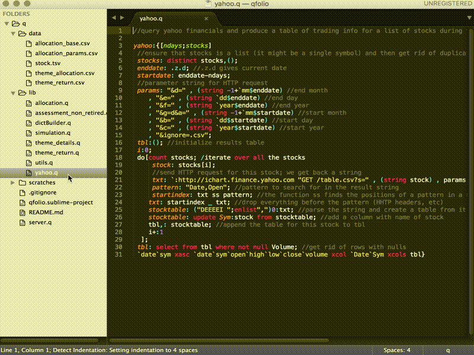
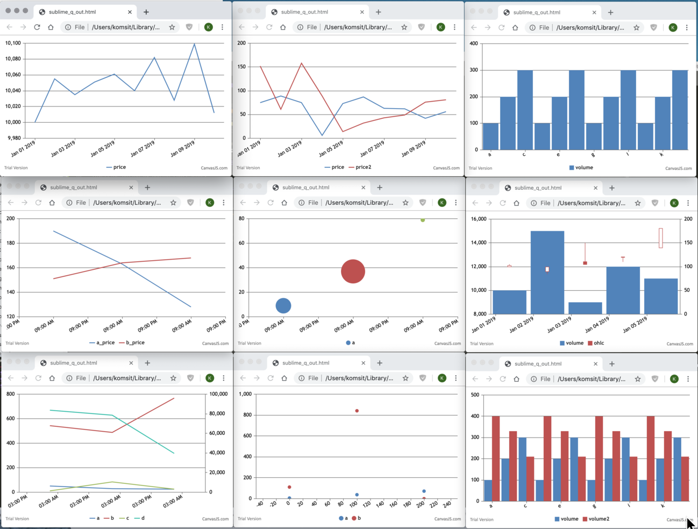
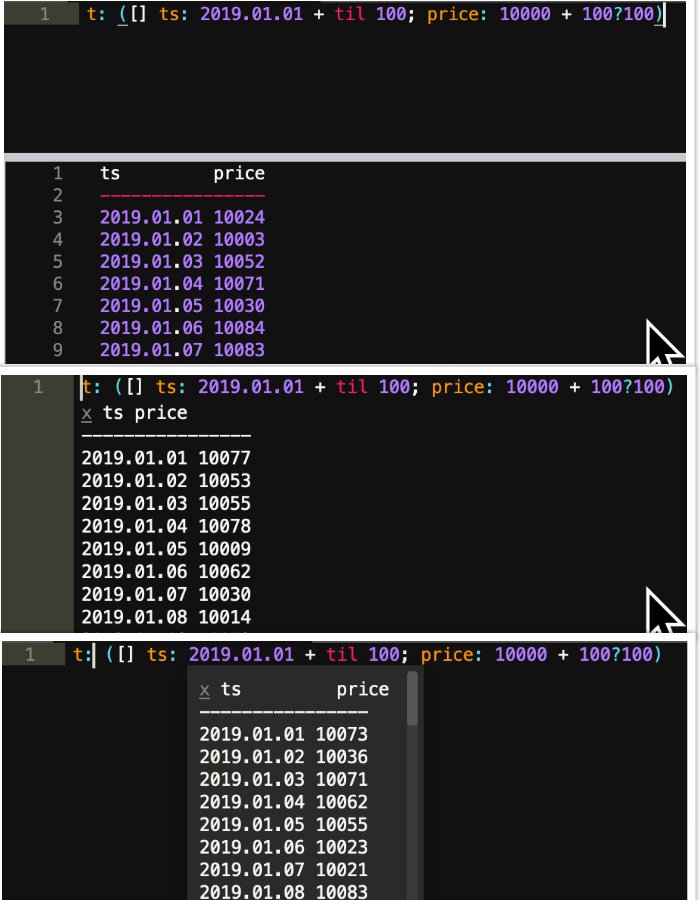
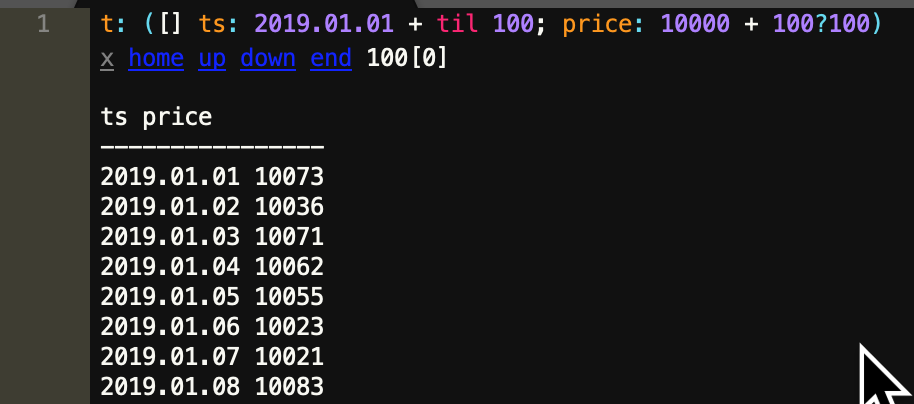

# q REPL for Sublime Text 3
Connect to remote q session and execute q statements in Sublime Text



* `Cmd + alt + q` to add q connections and quickly switch between them
* `Cmd + Enter` to send highlighted line or block text to selected q session and show results in output panel
* `Cmd + Shift + Enter` same as above, but show reult in phantom
* `Cmd + e` same as above, but show reult in popup
* `Cmd + j` same as above but get result as json (by calling .j.j to results - requires .j.j in kdb 3.x)
* define and run custom routine with `Cmd + alt + r`
* 3 result modes: **output panel**, **inline popup**, and **phantom** (inline block)
* Syntax higlighing (based on kimtang's https://github.com/kimtang/sublime-q)
* shows rows, column, time, mem usage at status bar
* auto complete
* plot table data in html/js chart (similar to Studio for Kdb+ - with a few customizations)

[change Cmd to Ctrl for windows]

### Shortcut

* `F1` open help at cursor
* `F2` print variable at cursor
* `Shift + F2` browse table variable at cursor
* `F3` show type at cursor
* `F4` plot latest data in browser
* `shift + F4` show latest data in browser using datatable js
* `F5` show environments
* `shift + F5` show memory usage
* `F6` show table and column names

[hold shift to show output in inline popup instead of output panel]


## Installation
via package control https://packagecontrol.io/packages/q%20KDB

## Features

### Chart
Shortcut `F4` will plot html/js chart from the latest REPL result (the usage is similar to Studio for Kdb+ - with a few chart customizations). See [chart/example.q](./chart/example.q)

```q
/default is line chart
lineData: ([] ts: 2019.01.01D00:00 + 1D * til 10; price: 10000 + 10?100)
/multiple series - 1 column per series
multilineData: ([] ts: 2019.01.01D00:00 + 1D * til 10; price: 10?100; price2: 10?200)
/change to column chart if first column type is symbol
colData: ([] sym: `a`b`c`d`e`f`g`h`i`j`k`l; volume: 12#100 200 300)
/you can also have multiple series for column chart
multicolData: ([] sym: `a`b`c`d`e`f`g`h`i`j`k`l; volume: 12#100 200 300; volume2: 12#400 330 210)
/use candlestick automatically if column name contains open, high, low, close. with optional volume column
ohlcvData: ([] date: 2019.01.01 + til 5; high: 105 99 150 120 180; low: 99 84 110 110 150; close: 102 99 105 120 180; open: 100 90 110 120 140; volume: 10000 15000 9000 12000 11000)
/multiple series - if second column type is symbol
multiSymData: ([] date: 6#(2019.01.01 + til 3); sym: raze 3#'`a`b; price: 100 + 6?100)
/auto generate 2nd axis if range is more than 50 times different 
needAxis2Data: ([] time: "z"$2019.01.01 + til 3; a: 3?100; b: 3?1000; c: 3?100; d: 3?100000)
/can also plot list or dict directly
10?100
(`a`b`c)!(100; 120; 130)

/override option by adding chart hints
/s - change type to scatter by prefixing s: to column name
`ts`s:a`s:b xcol pointData: ([] ts: 100 * til 3; a: 3?100; b: 3?1000)
/y2 - specify 2nd axis by prefixing y2: to column name
`time`a`y2:b xcol ([] time: 2019.01.01 + til 3; a: 3?100; b: 3?1000)
/bu - bubble chart will use next column as bubble size
`time`bu:a xcol ([] time: 2019.01.01 + til 3; a: 3?100; b: 3?1000)
```



### Output
There are 3 output modes to show results from q statement:
* `Cmd + Enter` output panel - I mostly use this
* `Cmd + Shift + Enter` inline phantom - Use this when you need some reference data
* `Cmd + e` overlay popup - I don't use this so much



Extra: shortcut `Shift + F2` let you browse table variable at cursor - by utilizing `.h.jx`



### Custom Routine
Define your own custom routine. Shortcut `Cmd + alt + r` will bring up custom routine option. For example:

```json
  "routines": [
		{
		  "name": "show",
		  "description": "show variable at cursor",
		  "command": {"qstatement": ".Q.s {0}", "output": "q_out_panel"}
		}
	]
```

Where `{0}` is the variable name at cursor. You can also define shortcut by referring to the routine by name:

```json
{ "keys": ["f2"],       "command": "q_routine", "args": {"name": "show"}, "context":[{ "key": "selector", "operator": "equal", "operand": "source.q" }]},
```

See more example in [settings/sublime-q.sublime-settings](./settings/sublime-q.sublime-settings)

Please feel free to open issues for any feedback, bug, or feature requests.

## Contribute

Clone this git repository into your `Sublime Text 3/Packages` directory.
NOTE: You may need to change dir to `q KDB`

* Windows: `C:\Users\[username]\AppData\Roaming\Sublime Text 3\Packages`
* OS X: `~/Library/Application Support/Sublime Text 3/Packages`

```
git clone https://github.com/komsit37/sublime-q.git 'q KDB'
```
From sublime text, run package control: satisfy dependencies (you may need to open package folder in sublime text first). This will install numpy as a dependency package to your packages folder

### Supported OS
* osx_x64
* windows_x64
* linux_x64

### Not supported OS
Support can be easily extended by adding proper numpy 1.8 build with python 3.3 (see https://github.com/komsit37/sublime-q/issues/12). Please send PR if you can build any of these:
* osx_x32
* windows_x32
* linux_x32

This plugin is for Sublime Text 3. For Sublime Text 2, please use https://github.com/komsit37/sublime-q-2

### To build numpy
Included numpy version should work for osx and windows 64bit, but if you need to build numpy

1. download python 3.3
2. download http://sourceforge.net/projects/numpy/files/NumPy/1.8.1/
3. run `python3.3 setup.py install`
4. numpy will be installed to your default python lib
5. then follow steps here https://github.com/komsit37/sublime-q/issues/12
